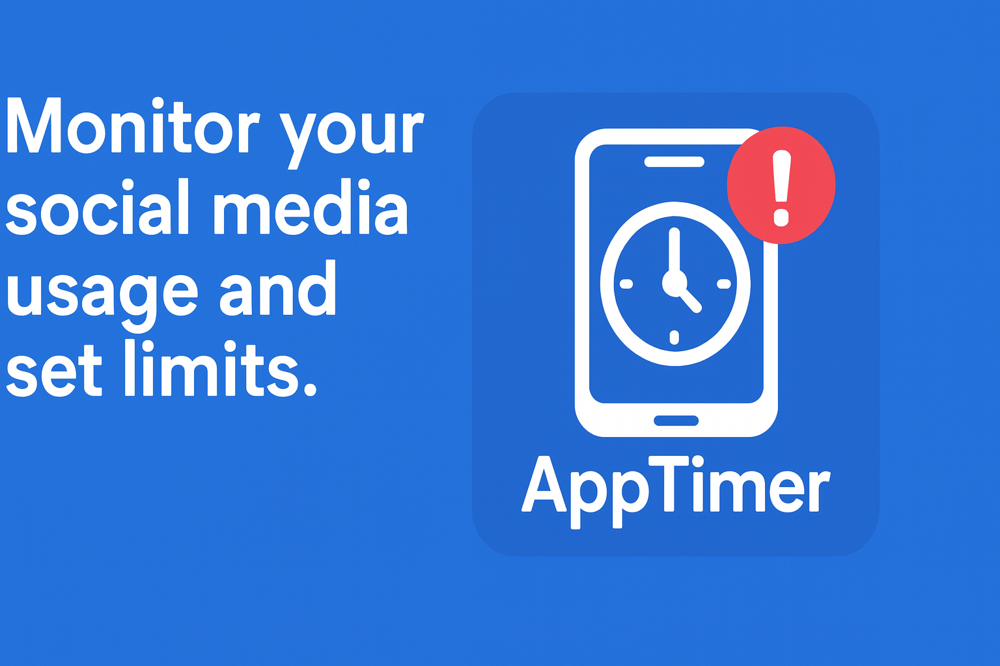
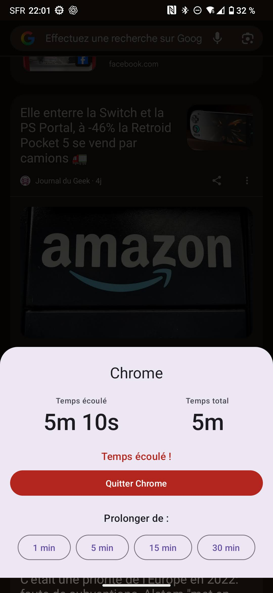

# AppTimer

AppTimer is an Android application designed to help you manage your screen time. It monitors the apps you use and allows you to set time limits for each of them.

## Logo

## Features

*   **Application Usage Monitoring**: AppTimer runs in the background to track the time you spend on each app.
*   **Customizable Timers**: Set daily time limits for specific applications.
*   **Time Alerts**: A discreet floating bubble notifies you when your time is almost up.
*   **Time Extension**: Need a few more minutes? Easily extend the timer when you need it.
*   **Screen Control**: AppTimer intelligently pauses timers when your screen is off to save battery.

## How it works

The application uses Android's `UsageStatsManager` to track the foreground application. A background service continuously monitors the running application and manages the timers. When the time allotted for an application is almost up, a floating bubble appears, giving you the option to extend your session or close the application.

## Architecture

The application follows a clean architecture pattern, separating the business logic from the UI and data layers. The core business logic is encapsulated in the `UAppMonitoring` use case, which can be found here:

[https://github.com/snigle/androidAppTimer/blob/main/app/src/main/java/com/github/snigle/apptimer/usecase/UAppMonitoring.kt](https://github.com/snigle/androidAppTimer/blob/main/app/src/main/java/com/github/snigle/apptimer/usecase/UAppMonitoring.kt)

## Screenshots

   
